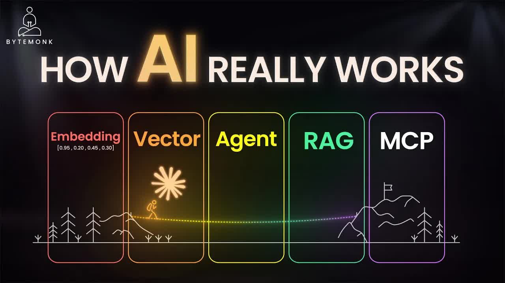

# Embeddings, Vector database Agent,, RAG & MCP： How Modern AI Systems Actually Work

| Property | Value |
|----------|-------|
| **Quality** | 480 |
| **Size** | 24.87 MB |
| **Password** | NO |

## Download Link

| `Embeddings-Vector-database-Agent-RAG--MCP-How-Modern-AI-Systems-Actually-Work.mp4` | [Download](https://raw.githubusercontent.com/muzaff-beep/RavenTube/main/videos/Embeddings-Vector-database-Agent-RAG--MCP-How-Modern-AI-Systems-Actually-Work_1779014075_3890/Embeddings-Vector-database-Agent-RAG--MCP-How-Modern-AI-Systems-Actually-Work.mp4) |
